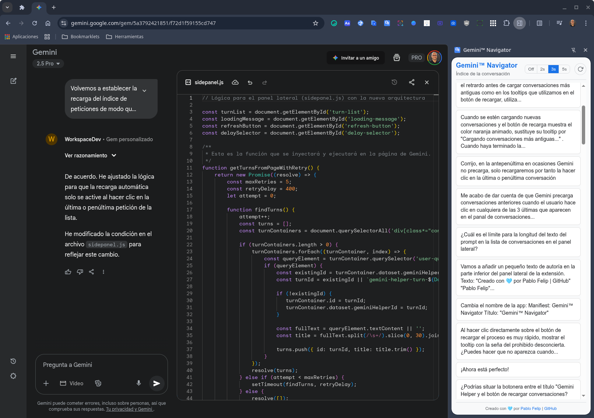

🇪🇸 [Versión en español](./README.md)

# Gemini™ Navigator

A Chrome extension to generate a conversation index and quickly navigate between prompts in the Gemini interface.

## Description

**Gemini™ Navigator** is a Google Chrome extension that enhances the Gemini user experience by adding a side panel with an index of all prompts in the current conversation. This allows you to jump directly to any point in the conversation with a single click, making it easier to navigate long and complex chats.

The extension is designed to be intuitive and integrates natively into the Gemini interface.

## How does it work?

Clicking on the extension icon opens a side panel (`Side Panel`) that displays a reverse chronological list of all the prompts you have made in the active conversation.

- **Quick Navigation:** Click on any prompt in the index for the main Gemini window to scroll smoothly to that question, highlighting it visually for a moment.
- **Smart Update:** Gemini loads older conversations as you scroll up. The extension is aware of this behavior. If you click on one of the last prompts in the index (the second to last or the last), the extension will wait a few seconds (a time you can configure) to give Gemini time to load the previous prompts into the DOM.
- **Reload and Synchronization:** After the wait, the index is automatically updated, adding the newly loaded prompts with a smooth visual effect so you can easily identify them. You can also force a manual reload at any time with the refresh button.

## Technical Details

- **Manifest V3:** The extension uses the latest version of the Chrome manifest.
- **Side Panel API:** The main interface is displayed using the Chrome `Side Panel API` for a clean integration.
- **Scripting API:** Scripts are safely injected into the Gemini page to analyze the DOM, identify prompts, and perform scrolling. The page content is not permanently modified.
- **Permissions:**
    - `sidePanel`: To display the side panel.
    - `scripting`: To execute code on the Gemini page.
    - `activeTab`: To interact with the active tab.
    - `storage`: To save the delay setting selected by the user.
- **Key Files:**
    - `manifest.json`: Defines the structure and permissions of the extension.
    - `sidepanel.html` / `sidepanel.js` / `sidepanel.css`: Make up the interface and main logic of the side panel.
    - `background.js`: Manages the opening of the side panel.
    - `content.js` / `content.css`: Inject the styles for the visual highlighting on the Gemini page.

## Installation (in developer mode)

Follow these steps to install the extension locally:

1.  Download and unzip the [zip file](https://github.com/pfelipm/gemini-navigator/archive/refs/heads/master.zip) or clone this repository on your machine.
2.  Open Google Chrome and go to the extensions page: `chrome://extensions`.
3.  Enable **"Developer mode"** in the upper right corner.
4.  Click the **"Load unpacked"** button.
5.  Select the project folder you downloaded.
6.  Done! The extension will appear in your list of extensions and will be active on `gemini.google.com`.

### Note on publishing to the Chrome Web Store

Since the extension is based on analyzing the DOM structure of the Gemini application, and this can change at any time without notice, the author prefers not to publish it in the Chrome Web Store for the time being. The maintenance cost and the need to adapt it to frequent changes make it more practical to distribute it as an open source project for manual installation.

## Credits

This project was created and is maintained by **[Pablo Felip](https://www.linkedin.com/in/pfelipm/)**.

## License

This project is distributed under the terms of the [LICENSE](/LICENSE) file.
