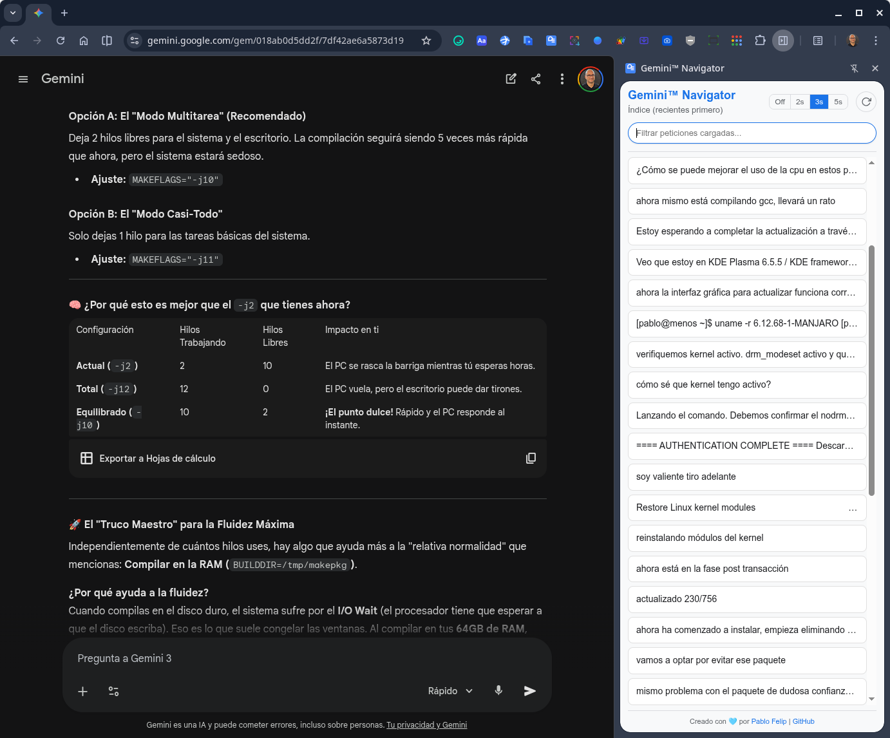
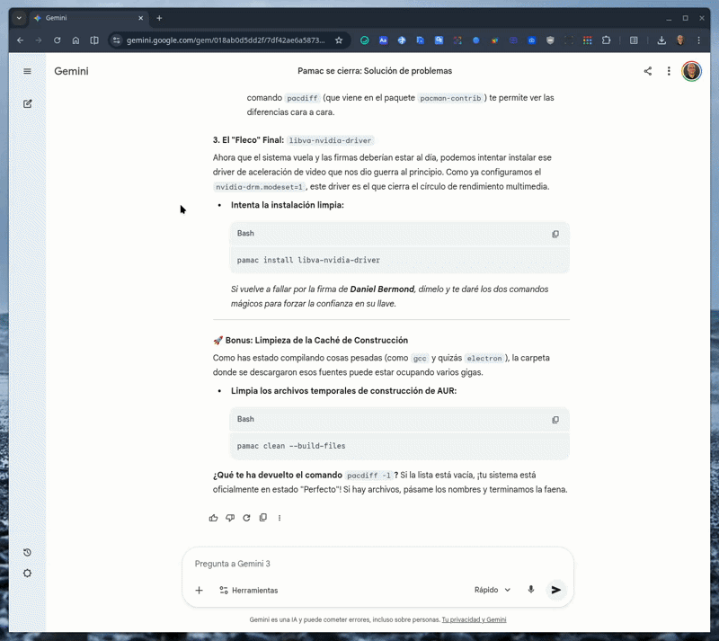

🇬🇧 [English version](./README.en.md)

# Gemini™ Navigator

Una extensión de Chrome para generar un índice de la conversación y navegar rápidamente entre las peticiones en la interfaz de Gemini.

## Descripción

**Gemini™ Navigator** es una extensión para Google Chrome que mejora la experiencia de uso de Gemini añadiendo un panel lateral con un índice de todas las peticiones (prompts) de la conversación actual. Esto permite saltar directamente a cualquier punto de la conversación con un solo clic, facilitando la navegación en chats largos y complejos.

La extensión está diseñada para ser intuitiva y se integra de forma nativa en la interfaz de Gemini.

## ¿Cómo funciona?

Al hacer clic en el icono de la extensión, se abre un panel lateral (`Side Panel`) que muestra una lista cronológica inversa de todas las peticiones que has realizado en la conversación activa.

- **🚀 Navegación rápida:** haz clic en cualquier petición del índice para que la ventana principal de Gemini se desplace suavemente hasta esa pregunta, resaltándola visualmente por un momento.
- **🔍 Filtrado instantáneo:** utiliza el cuadro de búsqueda superior para filtrar las peticiones en tiempo real. Ideal para encontrar rápidamente temas específicos en conversaciones largas sin tener que leer todo el índice.
- **⚡ Actualización automática:** ¡olvídate de recargar! La extensión detecta automáticamente cuando envías un nuevo mensaje a Gemini y actualiza el índice al instante para incluir tu nueva petición.
- **📜 Carga de historial:** Gemini carga las conversaciones más antiguas a medida que haces scroll hacia arriba. Si haces clic en una de las últimas peticiones del índice, la extensión esperará inteligentemente unos segundos (configurable) para permitir que Gemini cargue el contenido anterior antes de saltar a él.

## Características destacadas

*   **Índice automático:** genera una lista limpia y legible de tus prompts.
*   **Búsqueda integrada:** filtra por palabras clave para localizar peticiones específicas.
*   **Diseño robusto:** utiliza selectores semánticos (`<user-query>`) para asegurar la compatibilidad con futuras actualizaciones de Gemini.
*   **Estética nativa:** se integra visualmente con el diseño de Google, incluyendo truncado de texto elegante y modo oscuro (automático según el sistema/tema).
*   **Privacidad:** todo el procesamiento se realiza localmente en tu navegador. No se envía ningún dato a servidores externos.

## Detalles técnicos

- **Manifest V3:** la extensión utiliza la última versión del manifiesto de Chrome para máxima seguridad y rendimiento.
- **Side Panel API:** la interfaz principal se muestra utilizando la `Side Panel API` de Chrome.
- **MutationObserver:** se utiliza para detectar cambios en el DOM de forma eficiente y reactiva, sin recurrir a intervalos de tiempo (polling).
- **Web Animations API (WAAPI):** se emplea para gestionar el resaltado visual de los turnos de forma fluida y profesional, asegurando un desvanecimiento suave que no interfiere con los estilos internos de Gemini.
- **Scripting API:** se inyectan scripts seguros para analizar la estructura de la conversación y realizar el scroll.
- **Permisos:**
    - `sidePanel`: para mostrar la interfaz.
    - `scripting`: para interactuar con la página de Gemini.
    - `activeTab`: para acceder a la pestaña actual.
    - `storage`: para guardar tus preferencias de configuración.

## Instalación (en modo desarrollador)

Sigue estos pasos para instalar la extensión de forma local:

1.  Descarga y descomprime el [archivo zip](https://github.com/pfelipm/gemini-navigator/archive/refs/heads/master.zip) o clona este repositorio en tu máquina.
2.  Abre Google Chrome y ve a la página de extensiones: `chrome://extensions`.
3.  Activa el **"Modo de desarrollador"** en la esquina superior derecha.
4.  Haz clic en el botón **"Cargar descomprimida"**.
5.  Selecciona la carpeta del proyecto que has descargado.
6.  ¡Listo! La extensión aparecerá en tu lista de extensiones y estará activa en `gemini.google.com`.

### Nota sobre la publicación en la Chrome Web Store

Puesto que la extensión se basa en el análisis de la estructura del DOM de la aplicación de Gemini, y esta puede cambiar en cualquier momento sin previo aviso, el autor prefiere no publicarla en la Chrome Web Store por el momento. El coste de mantenimiento y la necesidad de adaptarla a cambios frecuentes hacen que sea más práctico distribuirla como un proyecto de código abierto para su instalación manual.

## Créditos

Este proyecto ha sido creado y es mantenido por **[Pablo Felip](https://www.linkedin.com/in/pfelipm/)**.

## Licencia

Este proyecto se distribuye bajo los términos del archivo [LICENSE](/LICENSE).
